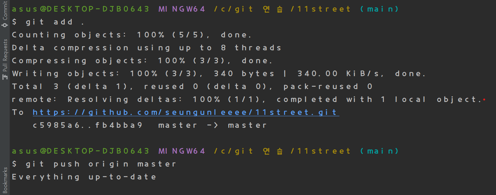
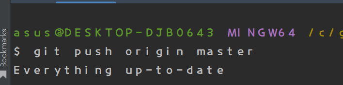
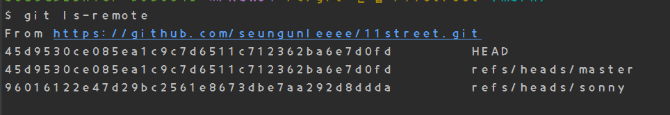
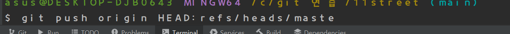

# 11street

git , QueryDSL 연습용 입니다. 

local branch main 에서 작성.

로컬 브랜치 메인에서 작성한 readme.md가 master branch로 안날라감

코드 또한 마찬가지 

로그는 늘라갔다고 뜨는 데..

Local의 master 브랜치에서 Local main 브랜치를 머지 한 후
Local의 master 브랜치에서  origin master로 push해야만 날라감
remote repository랑 local repo 관계가 어따구로 되있길래 이러는가 ..

master 브랜치에서 main에서 작성한 readme.md 를 merge 한 후
master 브랜치에서 해당내용들을 commit 
그러고 main에서  git push origin master 를 수행하였음
내용이 감 근데 master 브랜치에 있는 내용이 간것 같다 . 
로컬 메인에서 push했는데 왜 로컬 master내용이 갈까..

main 에서 push 해도 위와 같은 로그가 뜨는 것을 보니 
origin master 브랜치에 push 를 하려하면 local master브랜치의 내용을
push 하려하는게 맞는 것 같다. 
왜 이러는지.. origin master에 다른 local 브랜치도 push 하려면 우쨰야하나..

rebase (정리용)
sonny branch 

Local  main에서 쓴거임 
이건 억까다.
.......??????

썸띵온유ㅓ마인드??

from alphaasdadasd

아... ls-remote 에서 자기가 보낼 repo로

git push origin HEAD:refs/heads/master

이런 식으로 보내야하는구나.... 미안 git..

이제그냥 git push origin master 하면 main에서 보내질까??
