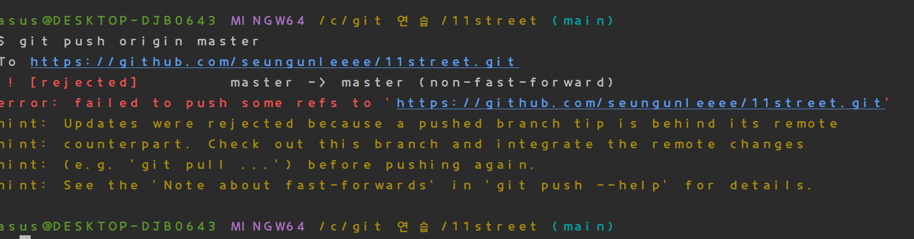
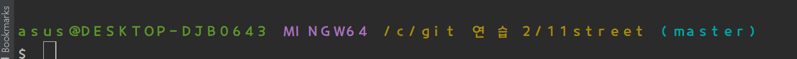
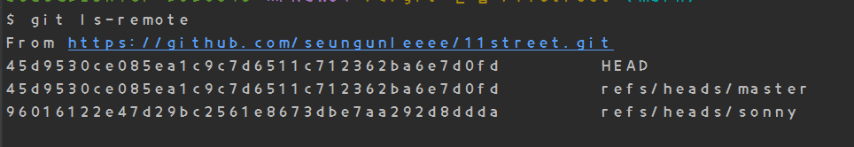
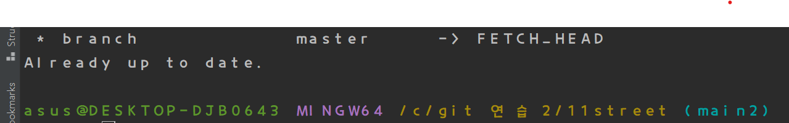
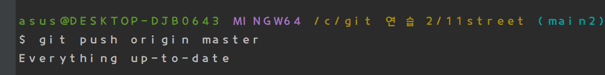
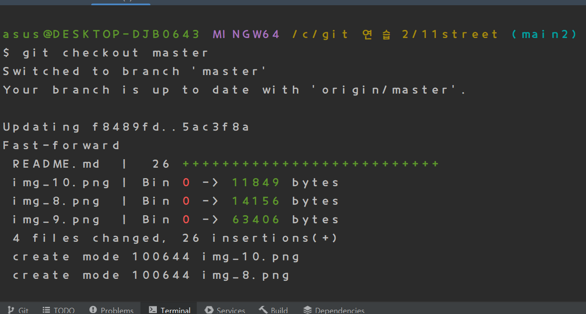

# 11street

git , QueryDSL 연습용 입니다. 

local branch main 에서 작성.

로컬 브랜치 메인에서 작성한 readme.md가 master branch로 안날라감

코드 또한 마찬가지 

로그는 늘라갔다고 뜨는 데..

Local의 master 브랜치에서 Local main 브랜치를 머지 한 후
Local의 master 브랜치에서  origin master로 push해야만 날라감
remote repository랑 local repo 관계가 어따구로 되있길래 이러는가 ..

master 브랜치에서 main에서 작성한 readme.md 를 merge 한 후
master 브랜치에서 해당내용들을 commit 
그러고 main에서  git push origin master 를 수행하였음
내용이 감 근데 master 브랜치에 있는 내용이 간것 같다 . 
로컬 메인에서 push했는데 왜 로컬 master내용이 갈까..

main 에서 push 해도 위와 같은 로그가 뜨는 것을 보니 
origin master 브랜치에 push 를 하려하면 local master브랜치의 내용을
push 하려하는게 맞는 것 같다. 
왜 이러는지.. origin master에 다른 local 브랜치도 push 하려면 우쨰야하나..

rebase (정리용)
sonny branch 

Local  main에서 쓴거임 
이건 억까다.
.......??????

썸띵온유ㅓ마인드??

from alphaasdadasd

아... ls-remote 에서 자기가 보낼 repo로

git push origin HEAD:refs/heads/master

이런 식으로 보내야하는구나.... 미안 git..

이제그냥 git push origin master 하면 main에서 보내질까??

(왜 오류 가 떳는가 ?? -> 로컬 메인 브랜치에서 git push origin HEAD:refs/heads/master 를 사용해
remote master브랜치에 push를 성공했다.
git push origin master를 실행했을 때 로컬 마스터 브랜치에서 push를 하려고하는데 
로컬 master브랜치의 헤드와 remote master브랜치가 가리키는 헤드가 달라서 그런 것 같다 .
)
여전히 push origin master 를 치면
local master 브랜치에서 merge 하려는 것 같다.
왜 local master 만 push origin master 가 될까.. 다른애로 못바꾸나...

다른 폴더에서 git clone을 했따 .
master 브랜치만 있는 상황이다 .
git checkout -t origin/sonny를 통해 
로컬 sonny 브랜치도 만들어줬다.

git연습2 폴더 에서 작성 , 로컬 브랜치 소니 ---> 리모트 브랜치 소니로..

git연습 2 local 브랜치 kane(origin/sonny 를 pull 한 브랜치)-->>remote sonny로
git push origin sonny 시도

여기서도 처음 생성한 로컬 sonny 브랜치에서 push 하려고함.

git push origin sonny 또한 로컬 소니 브랜치의 커밋을 푸시하려하기에
git push origin HEAD:refs/heads/sonny 명령어를 사용해 푸시를 성공했다.

git연습 2폴더의 main2 브랜치이다 . remote master브랜치를 pull 했다.

지금 작성한 이 내용들을 현재위치에서 git push origin master 를 한다면??
예상 -> 로컬 master 브랜치의 커밋을 푸시하려할것이다...
예상 2 -> 근데 로컬마스터 브랜치의 커밋은 fetch이후에 pull하고 안건드렸으니 up to date라 씨부리지안을까?

그렇다고 한다~ 
이 결과 글은 로컬 master 브랜치에서 로컬 main2를 merge한 후 
git push origin master 를 사용해 푸시해 봐야것다 .

readme 만 바뀌었기 때문에 fast-forward merge를 했다고 로그에 찍힌다,

로컬 마스터 브랜치에서 git push origin master를 해보자
----
로컬 마스터 브랜치에서 merge 하자마자 바로  push 하고 ,
그다음 위의 글을 쓰고서 push 했더니 오류없이 푸시되었다. 
만약 머지후 push를 바로안하고 무언가를 추가한 후 푸시한다면?

from main 2
